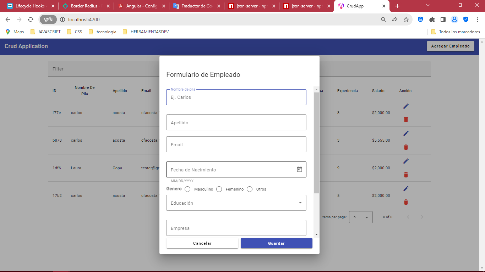
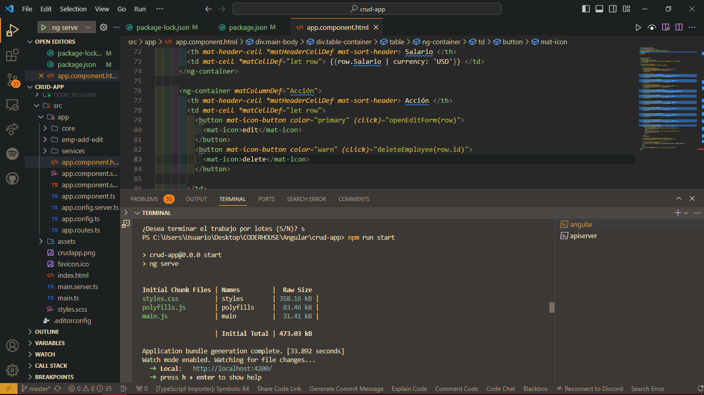
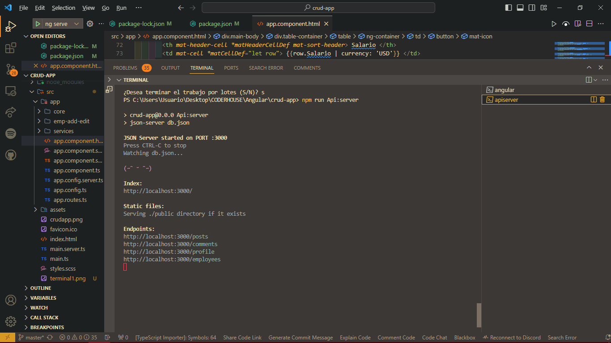
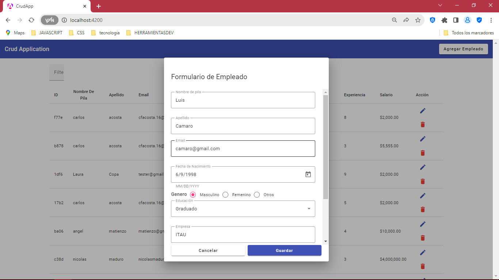

# CrudApp

<h3>Formulario de empleados Carlos Acosta &#127942;<h3>

<h5>Fue realizado para la entrega de la academia de Coderhouse comision <strong>#50260 &#128246;</strong> de Angular &#127942;<h5>

This project was generated with [Angular CLI](https://github.com/angular/angular-cli) version 17.0.7.

 
## Development server

<h1>1. Para la ejecuccion de la pagina se necesita primero inicializar <strong>npm run start<strong>&#128171; </h1>
 

<h1>2. Para inicializar el API usar el siguiente API en el terminal<strong>npm run Api:server</strong>&#128171; </h1>

<h1>3. luego de seguir los pasos correspondientes puedes inializar el proyecto y cargar los datos del empleado de una manera eficiente. Cargar|Eliminar|Modificar y Guardar. &#128171; &#127812; </h1>

Run `ng serve` for a dev server. Navigate to `http://localhost:4200/`. The application will automatically reload if you change any of the source files.

## Code scaffolding

Run `ng generate component component-name` to generate a new component. You can also use `ng generate directive|pipe|service|class|guard|interface|enum|module`.

## Build

Run `ng build` to build the project. The build artifacts will be stored in the `dist/` directory.

## Running unit tests

Run `ng test` to execute the unit tests via [Karma](https://karma-runner.github.io).

## Running end-to-end tests

Run `ng e2e` to execute the end-to-end tests via a platform of your choice. To use this command, you need to first add a package that implements end-to-end testing capabilities.

## Further help

To get more help on the Angular CLI use `ng help` or go check out the [Angular CLI Overview and Command Reference](https://angular.io/cli) page.
